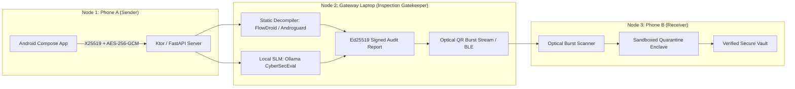

# ETIPOS: Encrypted Tunnels In Phones Obviously Secured
> **Zero-Trust, Local-Only, Air-Gapped Communication & Threat Sanitization Protocol**
> *Guided by: Dr. Mohammad Sirajuddin*
> *Team: Jainil Desai, Vavilala Asrith, Kanhaiya Kumar, Immadi Rohan*

---

## Overview

ETIPOS is an air-gapped secure file transfer and messaging protocol designed for high-security environments. It mitigates the privacy and grid/energy footprint risks of centralized cloud data centers by conducting in-flight static decompilation, local SLM threat scoring (Ollama / CyberSecEval), and post-quantum / AEAD encryption across a strictly local 3-node topology.



---

## Research Foundations

1. **Ephemeral Key Exchange**: Bernstein (2006) *Curve25519: new Diffie-Hellman speed records* (RFC 7748) & Diffie-Hellman (1976).
2. **Chunk Confidentiality & AEAD**: Rogaway (2002) *Authenticated-Encryption with Associated Data (AEAD)* (NIST SP 800-38D).
3. **Optical Air-Gap Transfer**: Scaife et al. (2014) *Air-Gapped Data Exfiltration and Transfer via Optical Channels*.
4. **Static APK Taint Analysis**: Arzt et al. (PLDI 2014) *FlowDroid* & Desnos (2012) *Androguard*.
5. **Local Quantized SLM Threat Scoring**: Frantar et al. (2022) *OPTQ/GGUF* & Bhatt et al. (Meta AI, 2023) *CyberSecEval*.
6. **Mobile Sandboxed Quarantine Enclaves**: Shabtai et al. (2010) & Kim et al. (2015).

---

## Project Structure

```
ETIPOS/
├── protocols/                     # Protocol specifications & Cryptographic Engine
│   ├── payload_spec.json         # JSON schema for frames, handshakes & threat reports
│   └── crypto_engine.py          # X25519 ECDH, AES-256-GCM AEAD, HMAC, Ed25519 signatures
│
├── gateway_server/                # Node 2: Gateway Security Gatekeeper
│   ├── server.py                 # FastAPI & WebSocket backend + Session Manager
│   ├── analyzer/
│   │   ├── static_analyzer.py    # APK Manifest & DEX bytecode / taint-sink inspector
│   │   └── ai_evaluator.py       # Ollama SLM & CyberSecEval benchmark evaluator
│   ├── airgap/
│   │   └── optical_burst.py      # Multi-frame QR burst generator (Scaife et al.)
│   └── dashboard/
│       └── index.html            # Real-time Glassmorphism Web Security Console
│
├── android-sender/                # Node 1: Android Sender App (Kotlin / Compose)
│   └── app/src/main/java/com/etipos/sender/
│       ├── crypto/CryptoEngine.kt
│       ├── network/GatewayClient.kt
│       └── ui/MainActivity.kt
│
├── android-receiver/              # Node 3: Air-Gapped Receiver App (Kotlin / Compose)
│   └── app/src/main/java/com/etipos/receiver/
│       ├── airgap/OpticalBurstScanner.kt
│       ├── crypto/SignatureVerifier.kt
│       ├── enclave/QuarantineEnclave.kt
│       └── ui/MainActivity.kt
│
└── tests/                         # End-to-End Automated Test Suite
    ├── test_crypto.py
    ├── test_static_analyzer.py
    ├── test_optical_burst.py
    └── test_gateway_server.py
```

---

## Quickstart

### 1. Run Automated Test Suite
```bash
python -m pytest tests/ -v
```

### 2. Launch Gateway Security Console (Node 2)
```bash
python gateway_server/server.py
```
Open your browser at `http://localhost:8000` to interact with the real-time Gateway Security Console.
- Drag and drop `.apk` files or enter encrypted text messages.
- View real-time decompilation audits and local SLM CyberSecEval threat breakdowns.
- Watch animated optical QR bursts transmitting across the physical screen to Phone B.

---

## Verified Test Results

All 12 unit & integration test suites passed:
- `test_x25519_key_exchange_and_derivation` 
- `test_aes_gcm_chunk_encryption_decryption` 
- `test_chunker_and_reassembly_multichunk` 
- `test_ed25519_gateway_signature_verification` 
- `test_handshake_and_chunked_upload_flow` 
- `test_direct_inspect_blocked_malware` 
- `test_stats_endpoint` 
- `test_optical_burst_generation_and_reconstruction` 
- `test_optical_burst_missing_frame_error` 
- `test_malicious_apk_detection` 
- `test_benign_apk_clean_pass` 
- `test_prompt_injection_in_text_payload` 
