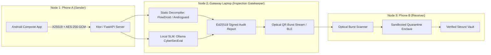

# ETIPOS: Encrypted Tunnels In Phones Obviously Secured

---

## Overview

ETIPOS is an air-gapped secure file transfer and messaging protocol designed for high-security environments. It mitigates the privacy and grid/energy footprint risks of centralized cloud data centers by conducting in-flight static decompilation, local SLM threat scoring (Ollama / CyberSecEval), and encryption across a strictly local 3-node topology.



---

## Research Foundations

1. **Ephemeral Key Exchange**: Bernstein (2006) *Curve25519: new Diffie-Hellman speed records* (RFC 7748) & Diffie-Hellman (1976).
2. **Chunk Confidentiality & AEAD**: Rogaway (2002) *Authenticated-Encryption with Associated Data (AEAD)* (NIST SP 800-38D).
3. **Optical Air-Gap Transfer**: Scaife et al. (2014) *Air-Gapped Data Exfiltration and Transfer via Optical Channels*.
4. **Static APK Taint Analysis**: Arzt et al. (PLDI 2014) *FlowDroid* & Desnos (2012) *Androguard*.
5. **Local Quantized SLM Threat Scoring**: Frantar et al. (2022) *OPTQ/GGUF* & Bhatt et al. (Meta AI, 2023) *CyberSecEval*.
6. **Mobile Sandboxed Quarantine Enclaves**: Shabtai et al. (2010) & Kim et al. (2015).

---

## Quickstart

### 1. Run Automated Test Suite
```bash
python -m pytest tests/ -v
```

### 2. Launch Gateway Security Console (Node 2)
```bash
python gateway_server/server.py
```
Open your browser at `http://localhost:8000` to interact with the real-time Gateway Security Console.
- Drag and drop `.apk` files or enter encrypted text messages.
- View real-time decompilation audits and local SLM CyberSecEval threat breakdowns.
- Watch animated optical QR bursts transmitting across the physical screen to Phone B.
- `test_benign_apk_clean_pass` 
- `test_prompt_injection_in_text_payload` 
